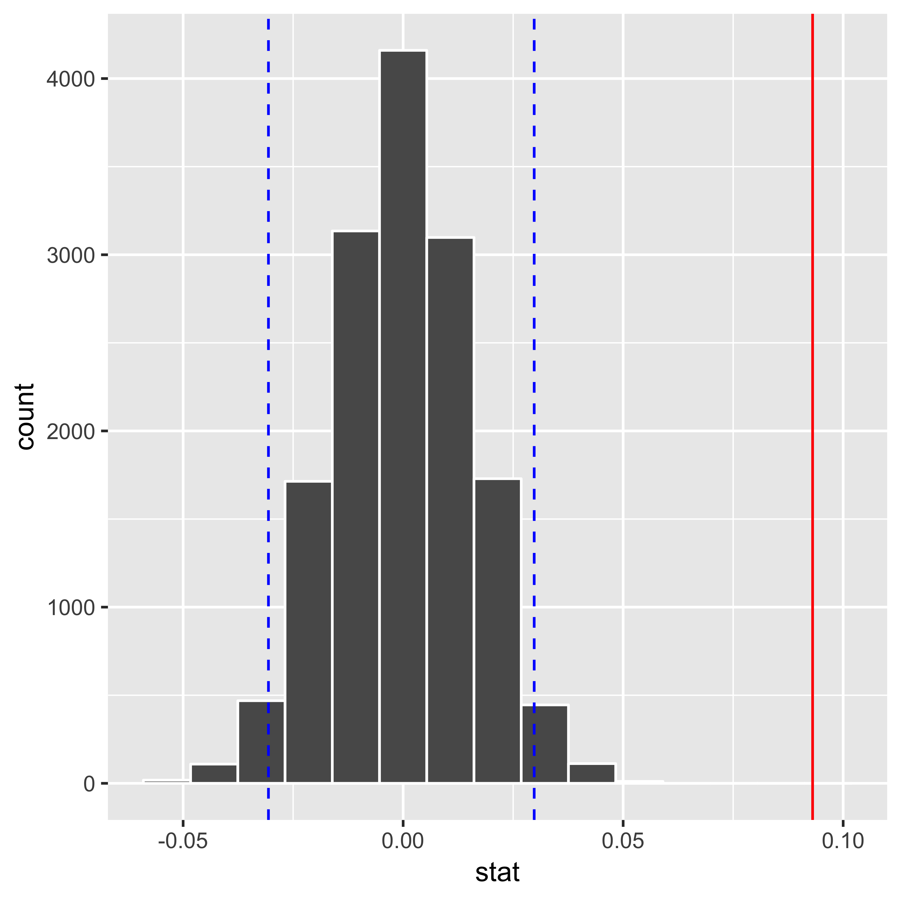

```{r setup, include=FALSE}
knitr::opts_chunk$set(echo = TRUE)
knitr::opts_chunk$set(fig.pos = 'H')

library(tidyverse)
```

# Introduction

Buying car insurance can be a daunting task and we want to understand how marital status plays a role in influencing a person's decison to buy a car insurance as the result of a cold call. In order to answer this question we performed a hypothesis test to assess if groups with different marital status show different proportions in their acceptance of the car insurance offered.

# Data Set Analysis

This project works with the Car Insurance Cold Calls data set, from Kaggle. It contains data about 4000 customers for a bank in the USA that received cold calls offering car insurance services. The dataset also includes the outcomes of said calls, i.e. if the customers acquired car insurance or not as a result of the call.

In the chosen data set, customers are classified as married, single, or divorced. Since we will perform a two-group hypothesis test, as a first step in our analysis, we broke down the customers into two groups, married and not-married, where the latter includes single and divorced individuals.

The figure below displays the breakdown between married and non-married individuals and whether members of each group accepted or not the car insurance offered on the call.  


<p>{width=340px}</p>

*Figure 1 - Initial exploratory analysis of the data suggests the proportion of married individuals that bought car insurance is different than that of non-married individuals.*


# Hypothesis Test

In order to answer the proposed question, the following hypothesis were formulated:

- $H_0$: Acceptance rate of car insurance offers for married individuals is no different than the acceptance rate for non-married individuals.

- $H_A$: Acceptance rate of car insurance offers for married individuals is different than the acceptance rate for non-married individuals.  

The figure below displays the null hypothesis distribution for the simulated data under the model $H_0$, along with the confidence interfals and the calculated test statistic:

<p align="center">{width=340px}</p>

*Figure 2: Null hypothesis distribution and $\delta\*$*

Finally, we calculated the p-value, which in our analysis is the percentage of the simulations in which the simulated difference in sample proportion is at least as extreme as the observed difference in sample proportions.

```{r include=FALSE, echo=FALSE}
summary = read_csv("../results/summarized_hypothesis_test.csv")
```

```{r include=TRUE, echo=FALSE}
knitr::kable(summary, caption = "Two-groups hypothesis test outcome")
```

Since the p-value obtained is less than the alpha (p-value < 0.05), then we reject the null hypothesis, and we say the result is statistically significant. In other words, we conclude that the acceptance rate of car insurance offered for married individuals is different than the acceptance rate for non-married individuals as stated in $H_A$.

# References

- "Car Insurance Cold Calls", Kaggle Dataset. https://www.kaggle.com/kondla/carinsurance#DSS_DMC_Description.pdf
https://courses.cit.cornell.edu/jl2545/4550/submitted%20presentations/insurance.pdf

- Yuki Iwase, Melissa Lercher, Michael Saridakis, Aline Schechter: The Auto Insurance Industry, AEM 4550 Spring 2015. https://courses.cit.cornell.edu/jl2545/4550/submitted%20presentations/insurance.pdf

- Hadley Wickham, Romain François, Lionel Henry, Kirill Müller(2018).dplyr: A fast, consistent tool for working with data frame like objects, both in memory and out of memory. R package version 0.7.6. https://cran.r-project.org/web/packages/dplyr/

- Hadley Wickham (2017). tidyverse: Easily Install and Load the 'Tidyverse'. R package version 1.2.1. https://CRAN.R-project.org/package=tidyverse

- Hadley Wickham, Winston Chang, Lionel Henry, Thomas Lin Pedersen, Kohske Takahashi, Claus Wilke, Kara Woo (2018). ggplot2: A system for 'declaratively' creating graphics, based on "The Grammar of Graphics". You provide the data, tell 'ggplot2' how to map variables to aesthetics, what graphical primitives to use, and it takes care of the details.R package version 3.0.0. https://cran.r-project.org/web/packages/ggplot2/
